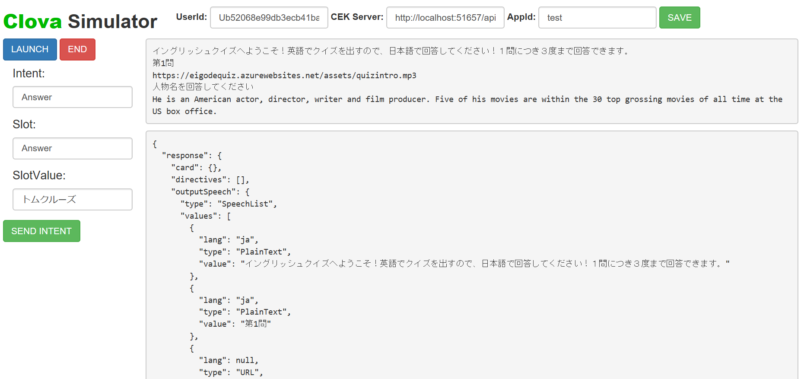

# Clova CEK Simulator

[日本語はこちら](./README_JA.md)

This repository contains clova simulator for CEK for debugging purpose to speed up your development.

# How to use it

1\. Clone the repository

```shell
>git clone https://github.com/kenakamu/clova-simulator
```

2\. Install dependencies.

```shell
>npm install
```

3\. Run the app. Pickup the right command for your environment. It runs server and opens a browser.

```shell
>npm run start
>npm run startMac
>npm run startLinux
```


4\. Enter "UserId", "CEK Server" and "AppId", then click "Save".

- UserId: The Id of user. you can use dummy or get from real environment.
- CEK Server: Your API server.
- AppId: Your skill application Id.

5\. Click "LAUNCH" to send Launch Request.

6\. Enter Intent and Slot information, then click "SEND INTENT".

7\. Click "END" to send SessionEnded Request.

# Display response from server

When the simulator receives response from your CEK server, it displays two things.

- The first box shows OutputSpeech data. This is something Clova will speak out.
- The second box shows entire response.



# Features

- Support Launch, Intent and SessionEnded requests.
- SessionAttributes are saved and sendback to server.
- SessionId will be auto-updated.

# Limitations

- No logic to add valid SignatureCEK. So please bypass signature validation when using simulator.
- No Event Request support.
- One Slot support. Add more if you need.

# License

[MIT](./LICENSE)