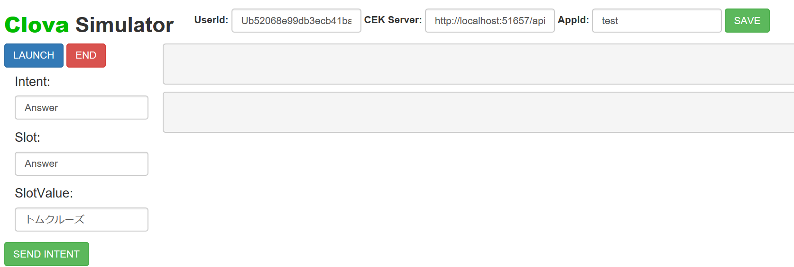

# Clova CEK シミュレーター

このレポジトリには クローバー CEK 用のシミュレーターがあります。開発効率が上がるように作りました。

# 使い方

1\. レポジトリをクローン。

```shell
>git clone https://github.com/kenakamu/clova-simulator
```

2\. 依存パッケージをインストール。

```shell
>npm install
```

3\. 環境にあうコマンドを実行してアプリを開始。サーバーが実行されブラウザが起動。画面がうまく表示されない場合はリフレッシュ。

```shell
>npm run start
>npm run startMac
>npm run startLinux
```


4\. "UserId", "CEK Server" および "AppId" を入力して "Save" をクリック。

- UserId: ユーザーの ID。実際の環境から取得する。ダミーでも OK。
- CEK Server: 開発しているスキル用の API サーバーアドレス。
- AppId: スキルアプリの ID。

5\. "LAUNCH" をクリックして LaunchRequest を送信。

6\. Intent と Slot 情報を入力後 "SEND INTENT" をクリックして IntentRequest を送信。

7\. "END" をクリックして SessionEndedRequest を送信。

# サーバーからの応答を表示

シミュレーターがサーバーから応答を受け取ると、以下 2 つの結果が表示されるます。

- 上の箱にはクローバーが話すテキストを表示。
- 下の箱には応答のすべてのデータを表示。


# 機能

- Launch, Intent および SessionEnded リクエストメッセージをサポート。
- セッション情報を自動保存し、サーバーに返す。
- Session Id は自動生成。

# 制限

- SignatureCEK ヘッダーは作成しないため、サーバー側で検証している場合はバイパスが必要。
- Event リクエストメッセージはサポートしていない。
- スロットは 1 つだけサポート。必要に応じて追加。

# ライセンス

[MIT](./LICENSE)